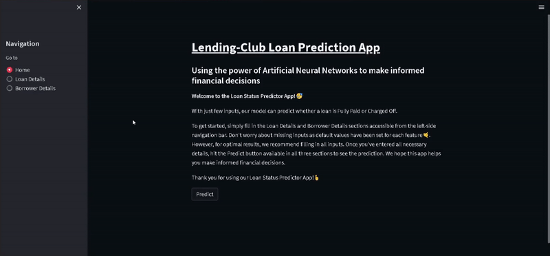

# 🏦 Lending Club Loan Prediction
[](https://www.kaggle.com/)
[](https://www.python.org/)
[](https://keras-team.github.io/keras-tuner/)
[](https://www.tensorflow.org/)
[](https://imbalanced-learn.org/stable/)
[](https://scikit-learn.org/stable/)
[](https://www.streamlit.io/)


## Table of Contents

 - [Demo](#demo)
 - [Overview](#overview)
 - [About the Dataset](#about-the-dataset)
 - [Motivation](#motivation)
 - [Installation](#installation)
 - [Deployement on Streamlit](#deployement-on-streamlit)
 - [Directory Tree](#directory-tree)
 - [Bug / Feature Request](#bug--feature-request)
 - [Future scope of project](#future-scope)
 - [Credits](#credits)

## Demo
- Link: https://sajid030-lending-club-loan-prediction-app-428myv.streamlit.app/

Note: If the website link provided above is not working, it might mean that the deployment has been stopped or there are technical issues. We apologize for any inconvenience.
- Please consider giving a ⭐ to the repository if you find this app useful.
- A quick preview of the loan prediction app:



## Overview

Welcome to the Loan Status Prediction app using Streamlit! This app utilizes deep learning to predict the loan status of an applicant, whether it's "Fully Paid" or "Charged Off".
- **Fully paid:** The applicant has successfully paid back the loan amount along with the interest rate within the given time frame.
- **Charged-off:** The applicant has not paid the instalments on time for an extended period, resulting in a loan default.

To use this app, simply fill out the required loan and borrower details, and let the model make the prediction for you. Our app's predictive capabilities are powered by deep learning, allowing for more accurate and reliable results.

*Dataset link is provided in the Credits section*

## About the Dataset
LendingClub is a US peer-to-peer lending company, headquartered in San Francisco, California. It was the first peer-to-peer lender to register its offerings as securities with the Securities and Exchange Commission (SEC), and to offer loan trading on a secondary market. LendingClub is the world’s largest peer-to-peer lending platform.

In this case study, we will explore how deep learning techniques can be used to predict the loan status of borrowers. This will give us an understanding of how real-world business problems can be solved using advanced machine learning methods. We will also gain insights into risk analytics in banking and financial services, and understand how data can be used to minimize the risk of losing money while lending to customers. By solving this case study, you will be able to build a solid foundation in deep learning and risk analytics, which are highly valued skills in the industry.

## Motivation

During my second year of college, I discovered my passion for Data Science. As I delved deeper into the subject, I was fascinated by the mathematics behind supervised and unsupervised machine learning models. However, I realized that it's not enough to just understand the theory - it's important to apply this knowledge to real-world problems to make a meaningful impact.
That's why I decided to build this loan status predictor app. By leveraging the power of artificial neural networks, this app can accurately predict whether a loan will be fully paid or charged off. Through this project, I hope to not only demonstrate my skills in Data Science but also make a positive contribution to the financial industry by improving risk assessment for lenders.

## Installation

This project is written in Python 3.10.10. If you don't have Python installed, you can download it from the [official website](https://www.python.org/downloads/). If you have an older version of Python, you can upgrade it using the pip package manager, which should be already installed if you have Python 2 >=2.7.9 or Python 3 >=3.4 on your system.
To install the required packages and libraries, you can use pip and the provided requirements.txt file. First, clone this repository to your local machine using the following command:
```
git clone https://github.com/Sajid030/Lending-Club-Loan-Prediction.git
```
Once you have cloned the repository, navigate to the project directory and run the following command in your terminal or command prompt:
```bash
pip install -r requirements.txt
```
This will install all the necessary packages and libraries needed to run the project.

## Deployement on Streamlit
1. Create an account on Streamlit Sharing.
2. Fork this repository to your GitHub account.
3. Log in to Streamlit Sharing and create a new app.
4. Connect your GitHub account to Streamlit Sharing and select this repository.
5. Set the following configuration variables in the Streamlit Sharing dashboard:
```
[server]
headless = true
port = $PORT
enableCORS = false
```
6. Click on "Deploy app" to deploy the app on Streamlit Sharing.

## Directory Tree

```
├── model
│   ├── dataset.pkl
│   ├── my_model.h5
├── resource 
│   ├── loanprediction.gif
├── app.py
├── LICENSE.md
├── loan_prediction.ipynb
├── README.md
├── requirements.txt
```

## Bug / Feature Request

If you encounter any bugs or issues with the loan status predictor app, please let me know by opening an issue on my [GitHub repository](https://github.com/Sajid030/Lending-Club-Loan-Prediction/issues). Be sure to include the details of your query and the expected results. Your feedback is valuable in helping me improve the app for all users. Thank you for your support!

## Future Scope

- Improving the model performance by trying different machine learning algorithms or hyperparameter tuning.
- Adding more features to the dataset, which could potentially improve the accuracy of the model.
- Deploying the model on a cloud platform like AWS, GCP or Azure for more scalable and reliable use.
- Integrating the model with other financial data sources to make more accurate predictions and provide better insights.
- Using natural language processing techniques to analyze borrower comments or reviews to identify any potential risks or fraud.

## Credits
- Dataset link : https://www.kaggle.com/datasets/janiobachmann/lending-club-first-dataset
- Dataset features details :https://github.com/dosei1/Lending-Club-Loan-Data/blob/master/LCDataDictionary.csv
